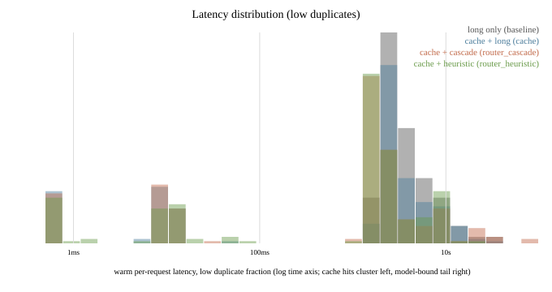
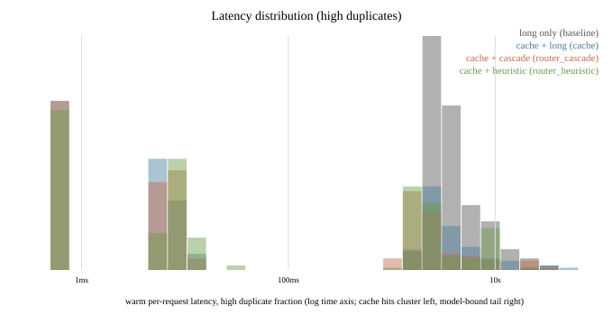
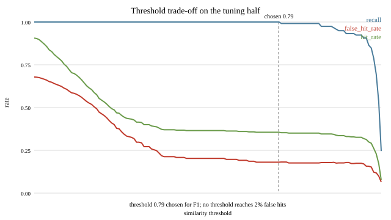
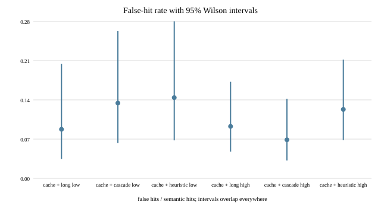
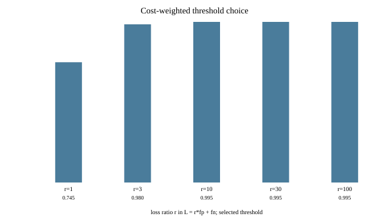

# llm-gateway-bench

One-model constraint, stated first because it changes what every number below
means: only deepseek-v4-flash answers on this gateway (probed 2026-09-17; five
listed models plus glm-5.3, all others quota-blocked or channel-less), so both
tiers are recipes of that one model — short (one sentence, 512 tokens) and
long (three sentences, 4096 tokens). Every "saving" here is measured token
saving from shorter answers and cache hits, not a vendor price comparison.

Question in one sentence: on a fixed request workload, how much does a
semantic cache plus a short/long-recipe router actually save, and what does it
cost in answer quality against an always-use-the-long-recipe baseline?

## Quickstart

What works with no credentials and no endpoint: the server starts and
`/health` answers, and every offline stage runs over committed data
(`lgb workload`, `lgb tune`, `lgb metrics`, `scripts/audit_docs.py`). What
does not work: a real completion. That needs the one thing this repository
cannot ship — an OpenAI-compatible `/v1` endpoint named by the environment
variable `LGB_GATEWAY_BASE_URL` (default `http://127.0.0.1:8787/v1`, the only
environment variable the stack reads for routing; `GSK_API_KEY` is sent as a
bearer token when set). With no endpoint reachable, `/v1/chat/completions`
returns HTTP 500 whose body names `LGB_GATEWAY_BASE_URL`.

Every measured number in this README came from a private dev gateway reachable
only from the author's machine: the pipeline is runnable and the committed
parquet is inspectable by anyone, but the measurements themselves are not
independently reproducible without an equivalent endpoint. This is a property
of the measurements, not a caveat about them.

Needs Python 3.11 and uv.

```
git clone https://github.com/urrra39/llm-gateway-bench && cd llm-gateway-bench
uv sync --frozen --extra embeddings

# Point the stack at your own OpenAI-compatible endpoint. Omit both and the
# server still starts; only /health will answer.
export LGB_GATEWAY_BASE_URL=http://127.0.0.1:8787/v1  # must end in /v1
export GSK_API_KEY=...                                # only if it needs a token

.venv/bin/python -m lgb serve --port 8000
```

Then, in a second terminal:

```
# answers with no endpoint configured
curl -s localhost:8000/health
# {"ok":true,"cache_size":0}

# needs an endpoint
curl -s localhost:8000/v1/chat/completions -H 'Content-Type: application/json' \
  -d '{"model": "deepseek-v4-flash", "messages": [{"role": "user", "content": "Say hello in one sentence."}]}'
# with an endpoint:
#   {"choices": [{"message": {"content": "...", ...}}], "x_gateway": {"mode": "router", "hit": false, ...}}
# without one, HTTP 500:
#   {"error": {"message": "chat failed for deepseek-v4-flash: ConnectError: ... .
#              No OpenAI-compatible endpoint answered at http://127.0.0.1:8787/v1.
#              Set LGB_GATEWAY_BASE_URL to a reachable /v1 endpoint (and GSK_API_KEY
#              if that endpoint needs a bearer token).",
#     "type": "upstream_unavailable", "param": "LGB_GATEWAY_BASE_URL"}}
```

One command reproduces the benchmark (about 45 minutes, resumable): `make all`
— against a working upstream only. Its `run-low`, `run-high` and `judge`
stages call the model, so with no endpoint configured `make all` stops at the
first `lgb run` and writes no results. The stages that need nothing beyond
this clone are `make workload`, `make tune`, `make metrics` and `make audit`.

Ceiling in own words: this benchmark cannot weigh production traffic. The
workload is constructed from PAWS pairs with fixed duplicate fractions, both
tiers have been one working model with two operating points since 2026-09-17,
and quality is one judge pair from the same model with no human verification.
Every cost number below is a function of the duplicate fractions, not a
prediction about anyone's traffic. See docs/CEILING.md.

Validity gates: all_gates_passed=false for run `full` (7/11 PASS, 4 FAIL).
Two failures forbid any correctness claim about the quality column: no human
has verified a label, and both judges are the same model. Two more say the
semantic cache is not shippable on this workload: its false-hit rate sits
above the 5% bar on both duplicate fractions. Every gate below compares a
measurement against a bound the data could have crossed, and the audit
refuses any gate that does not (`GATE_BOUNDS` in scripts/audit_docs.py).

| gate | status | observed |
|---|---|---|
| baseline_costs_more_low_cache | PASS | baseline 0.9226 vs cache 0.6139 |
| baseline_costs_more_low_router_cascade | PASS | baseline 0.9226 vs router_cascade 0.5336 |
| baseline_costs_more_low_router_heuristic | PASS | baseline 0.9226 vs router_heuristic 0.3282 |
| false_hit_rate_within_bound_low | FAIL | 0.0889 (4 of 45 semantic hits) vs bar 0.0500 |
| baseline_costs_more_high_cache | PASS | baseline 0.9187 vs cache 0.3792 |
| baseline_costs_more_high_router_cascade | PASS | baseline 0.9187 vs router_cascade 0.2294 |
| baseline_costs_more_high_router_heuristic | PASS | baseline 0.9187 vs router_heuristic 0.2212 |
| false_hit_rate_within_bound_high | FAIL | 0.0941 (8 of 85 semantic hits) vs bar 0.0500 |
| tuned_threshold_beats_random_control | PASS | tuned 0.79 f1 0.9007633587786259 vs control_mean 0.8279916296353538 max 0.9007633587786259 |
| human_label_coverage | FAIL | 0/60 = 0.000 |
| judge_independence | FAIL | primary deepseek-v4-flash == secondary deepseek-v4-flash; kappa 0.8034 (n=338) is self-consistency |

The 5% bar is a stated engineering choice, not a measurement: a semantic
cache that serves one confidently wrong answer per twenty semantic hits is
not shippable for correctness-sensitive traffic, and a false hit is worse
than a miss because the user gets no signal that anything went wrong. It is
defined once as `FALSE_HIT_RATE_BAR` in src/lgb/metrics.py.

No measured number moved in this round. The only changes to results.json are
the two false-hit gates: `false_hit_rate_reported_{low,high}` became
`false_hit_rate_within_bound_{low,high}`, and both flipped PASS to FAIL
because they now compare 0.0889 and 0.0941 against the 5% bar instead of
merely asserting that a rate exists. The gate line moved 9/11 PASS, 2 FAIL to
7/11 PASS, 4 FAIL. Every rate, interval and cost is byte-identical to the
previous results.json.

## Findings

1. The cache exchanges measured cost for measured quality. Cache-plus-long
   costs 0.6139 (95% boot 0.5126-0.7216) against a 0.9226 (95% boot
   0.8125-1.0404) baseline on low duplicates — a 33% saving with
   non-overlapping 95% cost intervals (paired 95% -0.001787 to -0.000833
   $/row) — and 0.3792 (95% boot 0.2554-0.5326) against 0.9187 (95% boot
   0.7973-1.0505) on high, a 59% saving, also separated (paired 95% -0.002810
   to -0.001551 $/row); quality equiv is 0.9308 (n=224; 95% boot 0.9040-0.9554)
   and 0.9085 (n=235; 95% boot 0.8766-0.9362) against the long-only baseline.
2. The p99 and the p50 move in opposite directions, and the shape change —
   not the point estimates — is the operationally important result here
   (magnitudes unquantified below).
   High-duplicate cache p99 reads higher than baseline (31169.6 ms vs
   25999.2 ms, magnitude unquantified: 95% intervals [11968.7, 49186.1] vs
   [14125.6, 41179.4] overlap); low-duplicate cascade p99 reads higher than
   baseline (37085.7 ms vs 25987.8 ms, magnitude unquantified: 95% intervals
   [20163.1, 68368.3] vs [15659.3, 30842.6] overlap). The tail belongs to the
   upstream model, not the cache: tail rows are cache misses emitting
   thousands of tokens with model time nearly equal to total latency, while
   cache lookup overhead is tens of milliseconds. See "The tail belongs
   upstream" below.
3. The false-hit rate runs from 6.98% (6 of 86; 95% Wilson 0.0324-0.1440) to
   14.63% (6 of 41; 95% Wilson 0.0688-0.2844) of semantic hits, and no
   threshold fixes it: on the tuning half the false-hit rate never falls
   below 6.45% even at threshold 0.995, where recall has already collapsed to
   0.25. The semantic cache is therefore not shippable for
   correctness-sensitive traffic on this workload; see the revised shipping
   recommendation.
4. The two routers are not separated on any single axis consistently. On low
   duplicates the heuristic costs less than the cascade (paired 95%
   -0.001608 to -0.000249 $/row, separated); on high duplicates the pair is
   not separated (paired 95% -0.000347 to 0.000235 $/row). On high duplicates
   the cascade scores higher quality (paired 95% -0.065957 to -0.004255,
   separated); on low duplicates quality is not separated (paired 95%
   -0.069507 to 0.004484). False-hit rates are not separated on either
   fraction (high: difference 0.0552, 95% Newcombe -0.0375 to 0.1527; low:
   difference 0.0100, 95% Newcombe -0.1420 to 0.1659). Resolving the
   high-fraction false-hit gap at conventional power needs about 451 semantic
   hits per arm, roughly five times the current denominators of 80 and 86 —
   the gap itself is not separated.
5. This experiment measured short answers, not cheap models. A real
   cheap/expensive pair with a genuine price ratio would show larger cost
   separation and a different quality cost; this benchmark estimates neither,
   and none of the router savings transfer to a vendor-switching decision.
   What transfers: the cache mechanics, the threshold trade curve shape, and
   the tail-latency behavior.

## Headline table

Run `full`: full report-half runs, both duplicate fractions. Threshold 0.79
from replay tuning on the held-out half. Judge self-consistency (κ) 0.8034
with n=338 (same model judging twice at temperature 0; no human has verified
any label).

Duplicate fractions (input parameters, recorded per workload): low is 10%
exact, 15% paraphrase, 5% trap, 70% novel; high is 30% exact, 30% paraphrase,
5% trap, 35% novel. Each fraction builds 500 requests; the report half is 245
attempted rows for low (237 successful baseline, heuristic and exact_only rows;
238 cache and cascade rows; the rest gateway errors excluded from metrics) and
249 attempted for high (246 successful rows in every config). The cache hit rate
is a property of this construction.

Machine config IDs are kept in parentheses so figures and tables map back to
`results.json` and the committed parquet; display names describe the recipe.

low duplicate fraction (report half: 245 attempted; successful: baseline 237, cache 238, cascade 238, heuristic 237, exact_only 237):

| config | recipe | cost USD | p50 ms | p95 ms | p99 ms | hit rate | false-hit rate | quality equiv |
|---|---|---|---|---|---|---|---|---|
| baseline | long only | 0.9226 (95% boot 0.8125-1.0404) | 3075.5 (95% boot 2788.2-3281.5) | 11657.0 (95% boot 10108.3-16990.5) | 25987.8 (95% boot 15659.3-30842.6) | 0.0 (0 of 237; 95% Wilson 0.0000-0.0160) | null | null (reference) |
| cache | cache + long | 0.6139 (95% boot 0.5126-0.7216) | 2505.1 (95% boot 2310.9-2631.5) | 10620.2 (95% boot 8478.9-13647.5) | 18942.7 (95% boot 13005.2-33566.0) | 0.2899 (69 of 238; 95% Wilson 0.2360-0.3505) | 0.0889 (4 of 45; 95% Wilson 0.0351-0.2073) | 0.9308 (n=224; 95% boot 0.9040-0.9554) |
| router_cascade | cache + short, escalate to long | 0.5336 (95% boot 0.3774-0.7204) | 1802.9 (95% boot 1657.2-1885.0) | 17513.6 (95% boot 8226.6-21257.7) | 37085.7 (95% boot 20163.1-68368.3) | 0.2815 (67 of 238; 95% Wilson 0.2282-0.3418) | 0.1364 (6 of 44; 95% Wilson 0.0640-0.2671) | 0.8678 (n=227; 95% boot 0.8326-0.9009) |
| router_heuristic | cache + short/long by heuristic | 0.3282 (95% boot 0.2794-0.3806) | 1772.6 (95% boot 1680.5-1856.5) | 9637.9 (95% boot 9021.5-10538.9) | 10972.3 (95% boot 10435.3-16598.5) | 0.2743 (65 of 237; 95% Wilson 0.2214-0.3343) | 0.1463 (6 of 41; 95% Wilson 0.0688-0.2844) | 0.8348 (n=233; 95% boot 0.7940-0.8734) |
| exact_only | exact only (replay) | 0.8049 (95% boot 0.6916-0.9251) | 2765.2 (95% boot 2523.8-3046.1) | 11407.4 (95% boot 9768.3-14544.1) | 18934.1 (95% boot 13728.6-29850.4) | 0.1097 (26 of 237; 95% Wilson 0.0760-0.1559) | n/a (cache run's exact hits: 1 of 24 judged scored 0) | unmeasured (see note) |

high duplicate fraction (report half: 249 attempted; successful: baseline 246, cache 246, cascade 246, heuristic 246, exact_only 246):

| config | recipe | cost USD | p50 ms | p95 ms | p99 ms | hit rate | false-hit rate | quality equiv |
|---|---|---|---|---|---|---|---|---|
| baseline | long only | 0.9187 (95% boot 0.7973-1.0505) | 3205.4 (95% boot 3040.1-3429.7) | 12331.5 (95% boot 10300.0-14125.6) | 25999.2 (95% boot 14125.6-41179.4) | 0.0 (0 of 246; 95% Wilson 0.0000-0.0154) | null | null (reference) |
| cache | cache + long | 0.3792 (95% boot 0.2554-0.5326) | 7.0 (95% boot 6.3-8.3) | 7825.5 (95% boot 4960.6-13023.0) | 31169.6 (95% boot 11968.7-49186.1) | 0.6423 (158 of 246; 95% Wilson 0.5806-0.6996) | 0.0941 (8 of 85; 95% Wilson 0.0485-0.1749) | 0.9085 (n=235; 95% boot 0.8766-0.9362) |
| router_cascade | cache + short, escalate to long | 0.2294 (95% boot 0.1372-0.3437) | 7.3 (95% boot 6.6-8.2) | 5751.3 (95% boot 3306.3-8629.6) | 24450.2 (95% boot 8618.0-29737.2) | 0.6463 (159 of 246; 95% Wilson 0.5848-0.7034) | 0.0698 (6 of 86; 95% Wilson 0.0324-0.1440) | 0.8619 (n=239; 95% boot 0.8285-0.8933) |
| router_heuristic | cache + short/long by heuristic | 0.2212 (95% boot 0.1618-0.2947) | 10.0 (95% boot 8.6-10.9) | 9084.1 (95% boot 6594.7-9581.8) | 10517.9 (95% boot 9310.4-16744.0) | 0.6057 (149 of 246; 95% Wilson 0.5434-0.6647) | 0.125 (10 of 80; 95% Wilson 0.0693-0.2150) | 0.8264 (n=242; 95% boot 0.7872-0.8636) |
| exact_only | exact only (replay) | 0.6245 (95% boot 0.5137-0.7465) | 2628.0 (95% boot 2422.5-2871.3) | 10388.2 (95% boot 8428.7-12483.4) | 25386.5 (95% boot 12483.4-41179.4) | 0.2967 (73 of 246; 95% Wilson 0.2431-0.3566) | n/a (cache run's exact hits: 0 of 71 judged scored 0; 2 unjudged) | unmeasured (see note) |

Quality equiv is mean judge score divided by 2, where 2 is equivalent to the
baseline, 1 is partial, 0 is wrong. False hits are semantic-cache hits the
judge scored 0; they are counted separately and never folded into hit rate.
Latency percentiles are warm (first request excluded); first-request latency
is about 2.2-3.0 s per config and is reported separately in results.json.

## Uncertainty: every rate with its denominator and method

Binomial rates (hit rate, false-hit rate, exact-match shares) carry 95%
Wilson score intervals, which behave at small counts and near zero where the
normal approximation does not. Means, sums and percentiles (quality equiv,
cost, latency) carry 95% percentile-bootstrap intervals from 10,000
resamples; resample seeds and index-matrix shas are stored beside each
interval in results.json. Newcombe score intervals cover false-hit rates
(denominators differ); lockstep paired bootstrap over shared row idx covers
cost, quality and p99.

| config | hit rate (k/n) [Wilson] | false-hit (k/n) [Wilson] | quality (n) [boot] | cost [boot] |
|---|---|---|---|---|
| low cache | 0.2899 (69 of 238) [0.2360, 0.3505] | 0.0889 (4 of 45) [0.0351, 0.2073] | 0.9308 (n=224) [0.9040, 0.9554] | 0.6139 [0.5126, 0.7216] |
| low cascade | 0.2815 (67 of 238) [0.2282, 0.3418] | 0.1364 (6 of 44) [0.0640, 0.2671] | 0.8678 (n=227) [0.8326, 0.9009] | 0.5336 [0.3774, 0.7204] |
| low heuristic | 0.2743 (65 of 237) [0.2214, 0.3343] | 0.1463 (6 of 41) [0.0688, 0.2844] | 0.8348 (n=233) [0.7940, 0.8734] | 0.3282 [0.2794, 0.3806] |
| high cache | 0.6423 (158 of 246) [0.5806, 0.6996] | 0.0941 (8 of 85) [0.0485, 0.1749] | 0.9085 (n=235) [0.8766, 0.9362] | 0.3792 [0.2554, 0.5326] |
| high cascade | 0.6463 (159 of 246) [0.5848, 0.7034] | 0.0698 (6 of 86) [0.0324, 0.1440] | 0.8619 (n=239) [0.8285, 0.8933] | 0.2294 [0.1372, 0.3437] |
| high heuristic | 0.6057 (149 of 246) [0.5434, 0.6647] | 0.1250 (10 of 80) [0.0693, 0.2150] | 0.8264 (n=242) [0.7872, 0.8636] | 0.2212 [0.1618, 0.2947] |

## The tail belongs upstream

Decomposed from the stored per-request records (`latency_ms`, `embed_ms`,
`lookup_ms`, `model_ms` in `data/runs/*/outcomes.parquet`; no re-run needed):

- Every tail row is a cache miss (or baseline direct call) emitting thousands
  of output tokens — e.g. low-duplicate cascade idx 436: 9216 tokens, 70403 ms
  total; high-duplicate cache idx 215: 8192 tokens, 55488 ms. Model time is
  nearly the whole latency.
- Cache mechanics cost milliseconds: semantic-hit p99 is 12–67 ms across all
  runs; typical miss overhead (embed plus lookup) is 10–60 ms, and miss p50 on
  high duplicates (3033 ms) matches baseline p50 (3205 ms). Two outliers show
  lock contention during full-store re-encode: one 2.4 s lookup on high/cache,
  one 16.5 s lookup on low/heuristic.
- The high-duplicate cache p99 reads higher than baseline (31169.6 ms vs
  25999.2 ms, magnitude unquantified: 95% intervals overlap) over a
  heavy-tailed upstream distribution at a different wall-clock time: 87 misses
  against 245 baseline calls. The cache adds no per-request cost that could
  explain seconds.
- The low-duplicate cascade p99 reads higher than baseline (37085.7 ms vs
  25987.8 ms, magnitude unquantified: 95% intervals overlap) for a structural
  reason that stands on token counts: an escalation pays two sequential model
  calls, short then long, with budgets doubled on empty first tries. That
  stacking is visible in the summed token counts.
- The heuristic p99 reads lower than baseline on low duplicates (10972.3 ms
  vs 25987.8 ms, a 15015.5 ms gap with paired 95% -20109.6 to -1588.5,
  separated) and on high duplicates (10517.9 ms vs 25999.2 ms, a 15481.2 ms
  gap with paired 95% -30827.9 to -3595.1, separated), because the short
  recipe caps output length and truncates the right tail.

Operational consequence: this stack cuts the high-duplicate median to single
milliseconds (95% cost and latency intervals below) but cannot cap the worst
case. Anyone with a latency SLO gets a different product than the p50
suggests — they need a deadline with fallback, not a median. The cascade
needs a tail-latency budget that skips escalation once the short call has
eaten most of it (recorded in docs/OPEN_DEFECTS.md, not implemented).




Measurement caveat: on escalated cascade rows `model_ms` double-counts the
short call (e.g. 80514 ms of model time inside a 70403 ms request), so the
decomposition above uses `latency_ms` for tail rows. Token and cost accounting
sum each call once and are unaffected.

## Duplicate-fraction sensitivity

Cost saving grows with repeats, quality cost does not disappear.
Cache-plus-long saves 33% on low (0.9226 [0.81, 1.04] to 0.6139 [0.51, 0.72],
95% cost intervals disjoint) and 59% on high (0.9187 [0.80, 1.05] to 0.3792
[0.26, 0.53], 95% disjoint). Cache plus heuristic routing shows a 64% saving
on low, separated (paired 95% -0.002952 to -0.002075 $/row), and 76% on high,
separated (paired 95% -0.003330 to -0.002366 $/row), at quality 0.8348 and
0.8264 respectively. A workload dominated by repeats would show larger
savings that mean nothing about production traffic.

## False hits: the trade curve and what ships

Loss function, stated plainly: a false hit serves a confidently wrong answer
to a user, while a miss only pays the full model price. The tuning objective
(F1, precision and recall weighted equally) does not know this, so threshold
0.79 is tuned for the wrong objective. Under any loss where a false hit costs
an order of magnitude more than a miss, the optimum moves up the curve below —
and the curve shows the cache cannot get there:

| threshold | hit rate (tuning half) | recall | false-hit rate |
|---|---|---|---|
| 0.79 (shipped, F1 choice) | 0.3556 | 1.0000 | 0.1806 |
| 0.85 | 0.3506 | 0.9915 | 0.1761 |
| 0.90 | 0.3432 | 0.9661 | 0.1799 |
| 0.95 | 0.3259 | 0.9237 | 0.1742 |
| 0.97 | 0.2988 | 0.8644 | 0.1570 |
| 0.99 | 0.1728 | 0.5339 | 0.1000 |
| 0.995 | 0.0765 | 0.2458 | 0.0645 |

Recall is 1.0000 from 0.30 through 0.79 and first drops at 0.795: the sweep
grid already starts at 0.30, so the saturation is measured (every should-hit
tune pair scores at or above 0.79), not a truncated grid. Under an explicit
cost-weighted loss L = r·fp + fn, recomputed over the same grid:

| loss ratio r | threshold | fp | fn | false-hit rate | recall |
|---|---|---|---|---|---|
| 1 | 0.745 | 26 | 0 | 0.1806 | 1.0 |
| 3 | 0.98 | 13 | 25 | 0.1226 | 0.7881 |
| 10 | 0.995 | 2 | 89 | 0.0645 | 0.2458 |
| 30 | 0.995 | 2 | 89 | 0.0645 | 0.2458 |
| 100 | 0.995 | 2 | 89 | 0.0645 | 0.2458 |

Under a 10x loss ratio the repository would choose 0.995 — the grid edge —
with recall 0.2458: the grid contains no acceptable point, which is why the
recommendation above does not name a semantic threshold at all.
`docs/figures/cost_weighted_threshold.svg` marks the three distinct argmins.

Why the tuning half reads hotter than the report half. Tuning-half false hits
are 26 of 144 eligible predicted hits (95% Wilson 0.1263-0.2514); report-half
are 4 of 45 (95% Wilson 0.0351-0.2073) on low duplicates and 8 of 85 (95%
Wilson 0.0485-0.1749) on high. Both report-half 95% intervals overlap the
tuning-half 95% interval, so the factor-of-two point gap is sampling noise,
not a split defect. Composition differs only in small counts (low trap rows 16 tune
against 9 report; high 9 against 16), and the denominators differ by
construction: the tuning rate is simulated over eligible tune rows while the
report rate is measured over semantic hits only.

No threshold reaches 2% false hits; at 0.995 the rate is still 6.45% with
recall destroyed. `docs/figures/threshold_tradeoff.svg` plots all three
curves with the chosen point marked. Revised recommendation: do not ship the
semantic cache for correctness-sensitive traffic on this workload. Ship the
exact-match cache — a verbatim repeat served from store — plus short-recipe
routing wherever one-sentence answers are acceptable.

Two exact-hit counts appear in this README and they count two things.
*Observed in the cache run*: the live cache answered 24 of 69 hits (34.8%)
from its exact tier on low duplicates, which is 24 of 245 attempted requests
(9.8%), and 73 of 158 hits (46.2%) on high, which is 73 of 249 attempted
requests (29.3%). *Available under exact-only replay*: with the semantic tier
switched off, the `exact_only` row above reaches 26 of 237 successful replay
rows (11.0%) on low and 73 of 246 (29.7%) on high. On low the two counts read
24 and 26 because a semantic hit is answered from store but never added to it.
Requests 438, 464 and 482 carry identical text, and in the cache run all three
were answered semantically at similarity 0.9966 against stored anchor idx 148,
so their own text never became an exact key. The replay has no semantic tier,
so request 438 is a model call whose text is stored, and 464 and 482 then
match it verbatim: 26 is 24 plus those two rows. Replaying the exact tier over
the cache run's own rows also reaches 26, so the two counts are not an
artifact of which rows errored in which run. On high duplicates no anchor is
absorbed this way and both counts read 73.

Exact hits are wrong only when the stored answer was wrong: 1 of 24 judged
exact hits scored 0 on low duplicates, 0 of 71 on high (2 unjudged), so
exact-match is near-error-free but not error-free. Those verdicts belong to
the cache run's own 24 exact hits; no judge scored the replay's 26. Quality
equiv for the replay is unmeasured — judging its stored texts would need new
judge calls — with the cache run's exact-hit verdicts (21 scored 2, 2 scored
1, 1 scored 0 on low; 68 scored 2, 3 scored 1 on high) as the closest observed
proxy, not a measurement. Hit latency in the replay is the measured median
cache_exact latency (0.53 ms low, 0.25 ms high): replayed, not measured, and
fresh upstream latency variance is not captured. Where approximate answers
are tolerable, threshold 0.97 keeps a 0.30 hit rate at 15.7% tuning-half false
hits; that is a product decision with eyes open, not a default.

What fooled the cache, in full. PAWS traps are near-duplicates with flipped
meaning, and embeddings rank them nearest:

1. high/cache idx 296, similarity 0.9786, trap. Request: `Explain this
   statement: "The problem of testing whether a given polynomial is a
   permutation polynomial through a finite field can be resolved in
   polynomial time ."` Cached answer explains brute-force evaluation over
   the finite field ("one can test this in finite time by evaluating f at
   every element"); baseline explains a polynomial-time decision procedure
   via algebraic criteria. Same words, different claim about complexity.
2. high/cache idx 269, similarity 0.9877, trap. Request about two pumping
   stations outside city limits in Toronto/York water service. Cached answer
   reverses the direction ("some of Toronto's water service is supplied by
   York"); baseline keeps Toronto supplying York Region. Direction flipped,
   vocabulary nearly identical.
3. low/cache idx 130, similarity 0.9990, trap. Request: `"Originally from
   Canberra , Holmes attended the Australian Institute of Sport in Sydney ."`
   Cached answer asserts Holmes was "originally from Sydney" and moved to
   Canberra — the exact opposite of the request — because the stored anchor
   had the cities the other way round. One swapped proper noun at 0.9990.

## Figures

Regenerate every figure from results.json in one command:

```
.venv/bin/python scripts/make_figures.py
```





- docs/figures/cost_by_config.svg: assumed cost by config for each fraction.
- docs/figures/quality_by_config.svg: quality equiv by config for each fraction.
- docs/figures/threshold_tradeoff.svg: recall, hit rate and false-hit rate
  across the tuning grid with 0.79 marked (source data/runs/threshold_sweep.parquet).
- docs/figures/fhr_intervals.svg: false-hit rate with 95% Wilson intervals
  per config; intervals overlap everywhere.
- docs/figures/cost_weighted_threshold.svg: selected threshold per loss
  ratio; the grid edge is the argmin from r=10 up.
- docs/figures/latency_low.svg and docs/figures/latency_high.svg: warm
  per-request latency distributions per config on a log axis.

## Reproduction

Requires Python 3.11, uv, and an OpenAI-compatible endpoint at
`LGB_GATEWAY_BASE_URL`. The measurements below came from a private dev gateway
on the author's machine at `http://127.0.0.1:8787/v1`, which answered keyless
(GSK_API_KEY is read when set and sent as a bearer token; verified keyless
2026-09-17). That endpoint is not reachable from anywhere else, so the
pipeline and the committed parquet reproduce for anyone but the measurements
do not: a stranger substituting their own endpoint runs the same code against
a different model and gets their own numbers, not these.

```
uv sync --frozen --extra embeddings
export LGB_GATEWAY_BASE_URL=http://127.0.0.1:8787/v1
make all
```

`make all` needs that endpoint for its `run-low`, `run-high` and `judge`
stages and stops at the first `lgb run` without one. `make pilot` runs a
50-request sanity path on the low fraction and needs the endpoint too.
`make all` rebuilds workloads, tunes the threshold on one half, runs all four
configs on both fractions, judges, assembles results.json, and audits docs.
All stages are resumable with atomic parquet checkpointing; a kill discards at
most one in-flight row. The embeddings extra (sentence-transformers plus torch
CPU) is needed for tuning and cached runs; serve alone answers with
exact-match caching without downloaded weights.

## Hardware and runtime

Measured 2026-09-17 on a local mac (darwin, arm64) with CPU only. Embeddings
are local all-MiniLM-L6-v2 (about 90 MB, resident under 1.5 GB); no component
needs a GPU. Full run wall-clock was about 42 minutes for 8 execution runs
plus 6 judging runs at concurrency 4 (see git log 11:49 to 12:31 local).
Latency numbers above are gateway-measured per request.

## Model and price-table cards

Gateway models listed 2026-09-17T07:43Z via `GET /v1/models`:
claude-opus-4-8, claude-opus-5, deepseek-v4-flash, gpt-5.6-sol, gpt-6-astra
(glm-5.3, the 2026-09-08 cheap tier, no longer listed and without a channel).
Probe used for each, 2026-09-17: `POST /v1/chat/completions` with model,
system prompt "Answer concisely, in at most three sentences.",
user content `Explain this statement: "The cat sat on the mat."`,
`max_tokens` 4096, `temperature` 0, `reasoning_effort` low. Only
deepseek-v4-flash returned content (219 chars); the other four returned
budget-quota exhaustion and glm-5.3 no available channel. No second model was
found, so nothing was re-run and no price split was simulated. A full
router re-run would have cost about 42 minutes wall-clock and about 4.15
assumed dollars of workload calls plus judging; it was not spent because
there is no second model to run it on.

Both tiers are deepseek-v4-flash with different recipes: short is one
sentence with 512 tokens; long is up to three sentences with 4096 tokens and
reasoning_effort=low. Judge primary and secondary are both
deepseek-v4-flash at temperature 0 with max_tokens 1200.

Prices as_of 2026-09-17 (assumed rate, not a provider quote): deepseek-v4-flash
input 1.50 and output 6.00 per million tokens. The gateway reports usage but
no price; every dollar figure is this table applied to measured tokens. Both
tiers share the rate, so savings are token savings.

Transfer note: a real cheap/expensive pair with a genuine price ratio would
show larger cost separation and a different quality cost. This benchmark
cannot estimate either and its router savings do not transfer to a
vendor-switching decision. What transfers is the cache mechanics, the shape
of the threshold trade curve, and the tail-latency behavior.

## Label provenance

Requests derive from PAWS labeled pairs (google-research-datasets/paws,
labeled_final/train, 3000-row committed sample in data/workload/paws_sample.csv).
Label 1 pairs give paraphrase should-hit rows; label 0 pairs give trap
should-not-hit rows. The similarity threshold 0.79 was tuned on one half and
reported on the other; the random-threshold control mean F1 is
0.8279916296353538 against tuned F1 0.9007633587786259.

Judge rubric is frozen in config/bench.yaml. Per-row verdicts persist under
data/runs/*/judge.parquet. Judge self-consistency is κ 0.8034 with n=338
(observed 0.9408, expected 0.6991): the same model judging twice, not
inter-family agreement. No human has verified any label.
data/human_validation.csv ships the 60 highest-value rows with an empty
human_label column, ordered false hits first, then judge disagreements, then
escalations (see `priority` in src/lgb/humanval.py). Fill it and run the exact
command below to compute judge-versus-human agreement with kappa plus its
denominator; rows with an empty human_label are skipped, so a partially
filled file already reports:

```
.venv/bin/python -m lgb human-agreement --csv data/human_validation.csv
```

Unverified labels are written as unverified.

## Serving with Docker (verified in CI, not locally: this machine has no Docker)

Container path verified by the `docker` job in
https://github.com/urrra39/llm-gateway-bench/actions/runs/35343182976
(image builds, `/health` returns ok, a keyless chat request 500s with `chat
failed` in the container logs, container torn down).

```
docker compose up --build
# gateway on localhost:8000 (container binds 0.0.0.0:8000)
curl -s localhost:8000/health
# {"ok":true,"cache_size":0}
```

Expected: image builds (torch CPU wheel plus ~90 MB embedding weights
download to data/models on first embed, needs network), `health` returns ok,
and the chat endpoint answers as in Quickstart. Without GSK_API_KEY the
container behaves like local runs: requests pass with no Authorization
header, which the dev gateway accepts. With nothing reachable at the
configured upstream, or against a keyed upstream with no key set, chat
returns HTTP 500 after 3 attempts with a JSON body that names the variable to
set — `{"error": {"message": "chat failed for deepseek-v4-flash: ...", "type":
"upstream_unavailable", "param": "LGB_GATEWAY_BASE_URL"}}` — and uvicorn logs
the same message. The container reaches the upstream via
LGB_GATEWAY_BASE_URL, default http://host.docker.internal:8787/v1 (Docker
Desktop); on Linux set LGB_GATEWAY_BASE_URL=http://172.17.0.1:8787/v1 or use
host networking.

## Limitations

- Workload is constructed; hit rate does not predict any real traffic.
- Two recipes of one model are not a market; router savings are brevity
  savings and do not transfer to vendor choice.
- One judge pair from the same model is not ground truth; no human labels exist.
- Prices are assumed; the measured quantity is tokens.
- Gateway exposes only one working model as of 2026-09-17; history with glm-5.3
  is archived and does not reproduce.
- Judge costs are not included in reported spend; total workload spend is about
  4.15 assumed dollars across all eight runs.
- Tail latencies reflect upstream variance at measurement time; the size of
  any p99 spread across configs is unquantified (see finding above).

## License

MIT. See [LICENSE](LICENSE).
